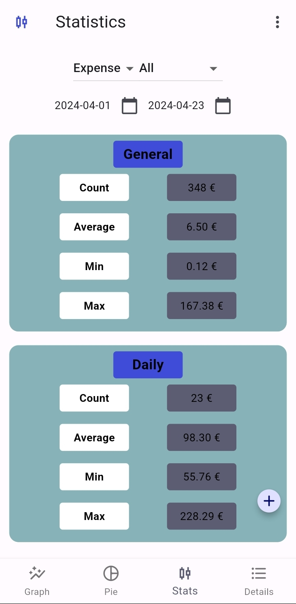
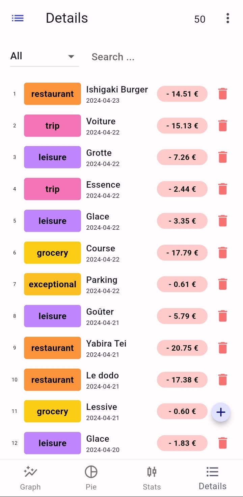

# Expenses Charts

This is a Flutter app to register expenses/incomes in a SQLite database.
There are different graphs and statistics based on different aggregates.
Currently built for Android.

## Table of contents

1. [General info](#general-info)
2. [Installing Project](#installing-project)
3. [Usage](#usage)

## General info

Using this app, you can manually register an expense or income with a specific category. Categories are hard coded for now.
These expenses can also be ingested (or exported) from a .db database or .csv, if fitting correctly.
Expenses can also be extended over a period (i.e., staying a week in a hotel can be considered as paying 1/7th each day).

### Pages available

* Bar chart (Daily, Weekly, Monthly and Yearly aggregates)

* Pie chart with total

* General statistics (Daily/Period mean, min, max ...)

* Details of each expense

### Tech

* Flutter 3.19.1
* SQFlite 2.3.0
* FL Chart 0.66.2

## Installing Project

Once you downloaded the project, make sure to have flutter installed. You can then launch the project, or just export an .apk.

## Usage

To register an expense, click the "+" button. You can update them in the details page by clicking on it.